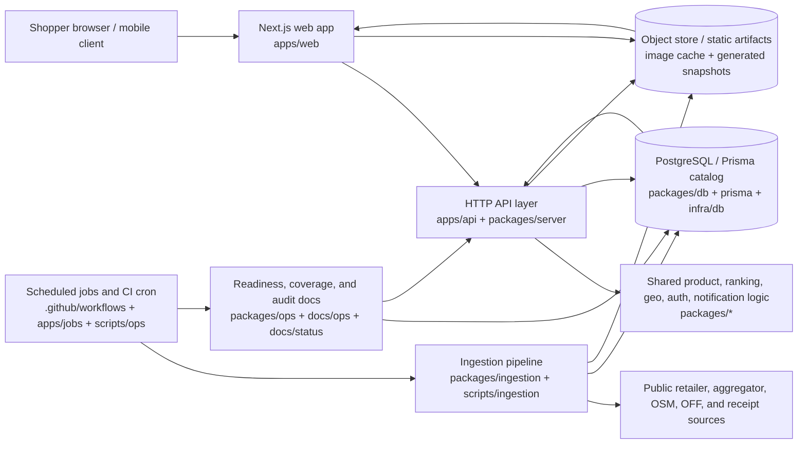

# GroceryView architecture

GroceryView is a monorepo that turns public grocery, store, receipt, and operational evidence into shopper-facing price intelligence. This document is the top-level map for new contributors and operators; lower-level data and production-readiness details are linked throughout.

## System diagram

## Boxes and responsibilities

### Web app

- **Primary code:** `apps/web`
- **Role:** Renders the public grocery terminal: products, categories, store maps, chain index, methodology pages, watchlists, basket views, and readiness-derived surfaces.
- **Inputs:** Server/API responses, generated static artifacts under `apps/web/src/lib/ingested`, DB snapshot modules under `apps/web/src/lib/generated`, SEO metadata, and shared UI/domain helpers.
- **References:** `README.md`, `apps/web/package.json`, `docs/status/completion-audit.md`.

### API layer

- **Primary code:** `apps/api`, `packages/api`, `packages/api-contracts`, and `packages/server`.
- **Role:** Exposes HTTP routes, validates request/response contracts, reads catalog and price evidence, and serves readiness and market/product data to the web app.
- **Inputs:** PostgreSQL via `packages/db`, shared domain models from `packages/core`, auth/session helpers from `packages/auth`, and generated ingestion artifacts.
- **References:** `apps/api/package.json`, `packages/server/package.json`, `packages/api-contracts/package.json`, `docs/ops/production-daily-ingestion-readiness.md`.

### Shared domain packages

- **Primary code:** `packages/core`, `packages/catalog`, `packages/geo`, `packages/analytics`, `packages/notifications`, `packages/scanning`, `packages/monetization`, and `packages/image-cache`.
- **Role:** Keep product normalization, ranking, geography, analytics, notification, receipt-scanning, monetization, and image-cache behavior reusable across apps, jobs, and tests.
- **Boundary:** Shared packages should not assume a specific UI route or cron workflow; callers pass data and configuration explicitly.
- **References:** package-level `package.json` files under `packages/*` and the feature/audit trail in `docs/audits/`.

### Ingestion pipeline

- **Primary code:** `packages/ingestion`, `scripts/ingestion`, and ingestion-related `scripts/ops` commands.
- **Role:** Fetches public retailer/aggregator/store data, normalizes rows, writes DB-backed source runs/raw records/observations/latest prices, and generates static web artifacts when needed.
- **Sources:** Retailer APIs and pages, OpenStreetMap/Overpass, Open Food Facts/OpenPrices, Matpriskollen/Matspar, fuel sources, and configured store enumerators.
- **Guardrails:** Connectors retain `sourceUrl`, timestamps, store ids when available, and fail closed on empty/insufficient captures where a partial scrape would be misleading.
- **References:** `docs/ingestion-playbook.md`, `docs/ingestion-targets.md`, `docs/data-sources.md`, `docs/ingestion/*.md`, `packages/ingestion/package.json`.

### Database

- **Primary code:** `packages/db`, `prisma/schema.prisma`, `db/`, and `infra/db`.
- **Role:** Stores normalized products, chains, stores, source runs, raw records, observations, latest prices, user preferences, and operational evidence required by coverage gates.
- **Access pattern:** Apps and jobs should go through typed DB helpers/readers instead of embedding raw SQL in UI components.
- **References:** `docs/data-architecture.md`, `infra/db/README.md`, `packages/db/package.json`, `prisma/schema.prisma`.

### Object store and generated artifacts

- **Primary code:** `packages/image-cache`, `apps/web/src/lib/ingested`, `apps/web/src/lib/generated`, and export scripts such as `scripts/ingestion/export-db-site-snapshot.mjs`.
- **Role:** Holds normalized static snapshots and cached public assets so the web app can render without live retailer calls.
- **Boundary:** Generated modules and cached assets must cite source provenance and should be replaced by export jobs rather than hand-edited when they represent live data.
- **References:** `packages/image-cache/package.json`, `docs/ops/production-daily-ingestion-readiness.md`, `scripts/ingestion/`.

### Cron and jobs

- **Primary code:** `.github/workflows`, `apps/jobs`, `workers/data-pipeline`, and `scripts/ops`.
- **Role:** Runs scheduled ingestion, production readiness checks, DB migrations, connector generation, snapshot export, and operational diagnostics.
- **Failure mode:** Cron should upload diagnostic artifacts even when an earlier step fails, so operators can distinguish missing config, connectivity, coverage, and runtime failures.
- **References:** `workers/data-pipeline/README.md`, `apps/jobs/package.json`, `docs/ops/production-daily-ingestion-readiness.md`.

### Monitoring, readiness, and audits

- **Primary code/docs:** `packages/ops`, `docs/ops/production-daily-ingestion-readiness.md`, `docs/status/completion-audit.md`, and `docs/audits/`.
- **Role:** Defines launch gates, catalog/source-run readiness, DB snapshot coverage, production secret validation, and historical delivery audits.
- **Operator contract:** A green build is useful only when its artifacts prove required chain/store/product/category/price-type coverage; readiness docs record which gates are authoritative and which blockers remain.
- **References:** `packages/ops/package.json`, `docs/status/completion-audit.md`, `docs/audits/`.

## Request and data flow

1. A shopper opens the Next.js web app in `apps/web`.
2. The web app renders static generated evidence where possible and calls API/server routes for dynamic prices, readiness, preferences, or personalized surfaces.
3. API/server code reads normalized catalog and price evidence from PostgreSQL through `packages/db` helpers and shared domain packages.
4. Scheduled jobs run ingestion connectors and DB snapshot exporters.
5. Ingestion fetches public sources, writes DB source-run evidence, updates latest prices, and emits generated artifacts for web build/runtime use.
6. Readiness and monitoring jobs validate production configuration, DB connectivity, source-run freshness, coverage targets, and exported snapshot completeness.

## Package map

| Area | Paths | Notes |
| --- | --- | --- |
| Web UI | `apps/web` | Public Next.js app and route/page tests. |
| API/server | `apps/api`, `packages/api`, `packages/api-contracts`, `packages/server` | HTTP routes, contracts, readiness, and data readers. |
| Jobs/workers | `apps/jobs`, `workers/data-pipeline` | Scheduled/background execution surfaces. |
| Data and DB | `packages/db`, `prisma`, `db`, `infra/db` | Prisma schema, migrations, DB helpers, Supabase/Postgres docs. |
| Ingestion | `packages/ingestion`, `scripts/ingestion` | Connectors, store enumerators, provenance verification, generated snapshots. |
| Shared domain | `packages/core`, `packages/catalog`, `packages/geo`, `packages/analytics` | Ranking, catalog, geography, and analytical primitives. |
| User features | `packages/auth`, `packages/notifications`, `packages/scanning`, `packages/monetization` | Auth/session, alerts, receipt scanning, and monetization helpers. |
| Operations | `packages/ops`, `scripts/ops`, `.github/workflows`, `docs/ops` | Production gates, cron utilities, diagnostics, and runbooks. |
| Static/generated assets | `packages/image-cache`, `apps/web/src/lib/ingested`, `apps/web/src/lib/generated` | Image cache and normalized source snapshots. |

## Related docs

- Data source inventory: [`docs/data-sources.md`](data-sources.md)
- Data architecture overview: [`docs/data-architecture.md`](data-architecture.md)
- Ingestion playbook: [`docs/ingestion-playbook.md`](ingestion-playbook.md)
- Ingestion target queue: [`docs/ingestion-targets.md`](ingestion-targets.md)
- Production daily ingestion readiness: [`docs/ops/production-daily-ingestion-readiness.md`](ops/production-daily-ingestion-readiness.md)
- Completion audit: [`docs/status/completion-audit.md`](status/completion-audit.md)
- Infrastructure docs: [`infra/README.md`](../infra/README.md) and [`infra/db/README.md`](../infra/db/README.md)
- Data pipeline worker: [`workers/data-pipeline/README.md`](../workers/data-pipeline/README.md)

## Notes for contributors

- Keep shopper-facing claims tied to generated data or DB-backed evidence.
- Prefer adding source-specific details to `docs/data-sources.md` or `docs/ingestion/*.md` and linking back here rather than duplicating long connector notes.
- Treat generated modules as artifacts unless the generating script explicitly expects a fixture edit.
- When adding a new runtime box, add it to the diagram, package map, and relevant readiness/runbook docs.
